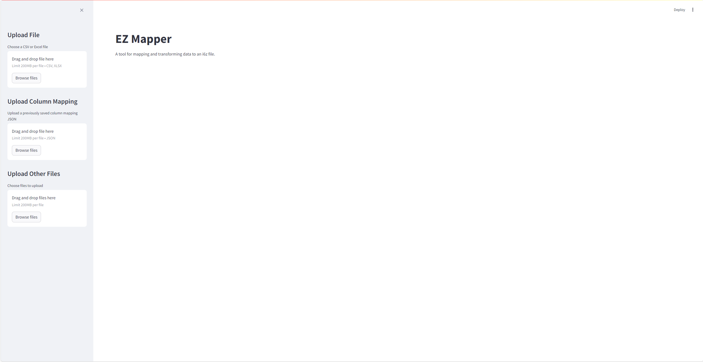
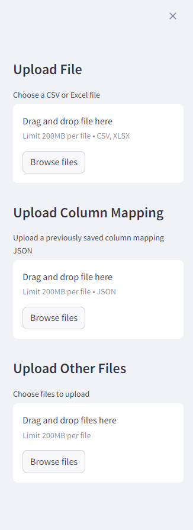
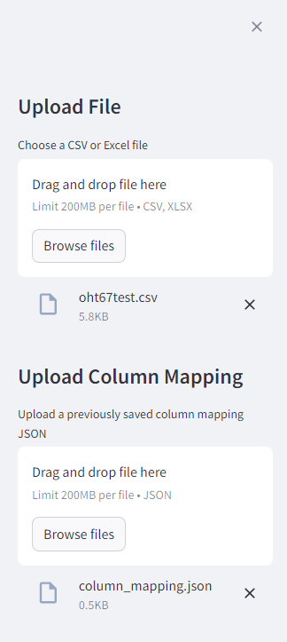
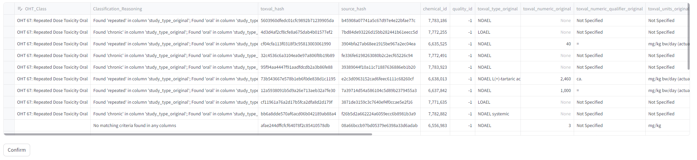
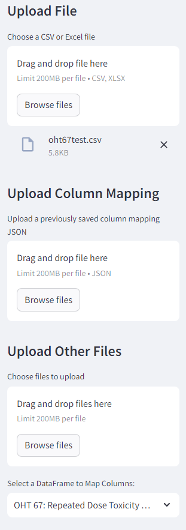
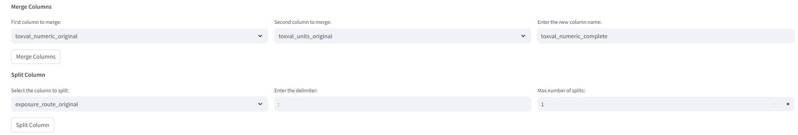
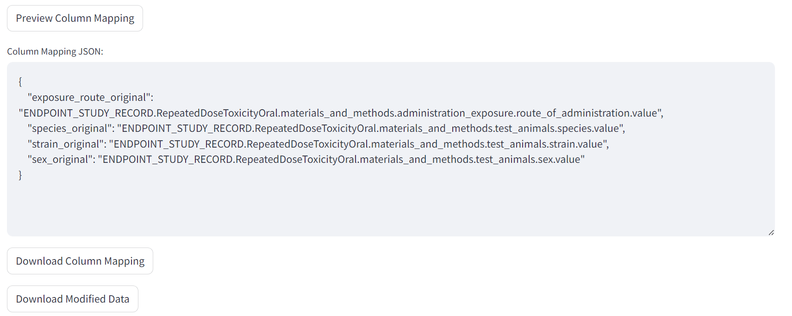
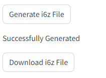

# EZ Mapper Vignette

## 1. Introduction and Purpose
**Description**: EZ Mapper is a tool designed for data transformation and mapping to the i6z format. This vignette provides an overview of the app’s key functionality and a step-by-step example of how to use the provided test input file.  
**Objective**: Guide users on how to upload data, classify rows, map columns, and generate an i6z file.

---

## 2. Setup and Installation
1. Make sure you are using **python version 3.8** (the app was built using 3.8.8). Later versions are not compatible with certain libraries that are
necessary for the machine suggestion functionality.
2. **Ensure dependencies are installed** by running:
   ```bash
   pip install -r requirements.txt
3. **Launch EZMapper** by running:
   ```bash
   streamlit run ezmapper.py
4. The app will open in your default browser, where you can follow the steps below.

---

## 3. Test Case Walkthrough
Using the test input "oht67test.csv" file with EZMapper, let's go thorugh a complete example.
### Step 1: Uploading Your Files

- In the sidebar, go to Upload File and Select the test input file (oht67test.csv).
- You may also click on Upload Column Mapping and select the json file (column_mapping.json).
- Optionally, you may add any number of .png, .jpg, or .pdf files to the Upload Other Files option. These
will be unmodified and attached within the i6z file generated.

### Step 2: Classifying Data
1. After uploading your file, a preview will display in the main panel to the right.
2. The machine suggestions logic will begin running in the background for column mappings.
3. Click on Classify Data to initiate data classification.
4. A new table will appear. The first column will give the recommended OHT for that row and the second column the reasoning for that recommendation.
### Step 3: Verifying and Editing Classifications
1. You can click on the values in the first column to manually set the OHT for each row.
2. Click Confirm when you are done.

### Step 4: Choose DataFrame
1. At the bottom of the left panel, a new option to select a DataFrame appears.
2. Select from the dropdown which DataFrame you want to work with and several more sections will appear in the main panel.

### Step 5: Modifying Data
- Merge Columns: Combine data from two columns into a new one.
- Split Columns: Split a column into multiple columns based on a delimiter.
- For either operation, select the button to apply the changes.

### Step 6: Map Your Columns
1. At the bottom of the panel, there is an option to "Click to show WORD document for the OHT" that shows the OECD Harmonised Template document for the chosen OHT. This file can help guide mapping decisions.
2. There will be a table with "User Column" with all columns in the user submitted data.
3. The second "OHT Column" allows you to click each cell and assign a OHT field mapping. You can start typing to reduce dropdown options. This column will also be prepopulated with any existing mappings based on you uploaded column mapping JSON file.
4. The third "Machine Suggestion Column Mapping" column will be populated with any and all suggested mappings based on the machine learning logic. This may not be populated at first but will update when the logic is finished running. There is a progress message at the top of the panel.
### Step 7: Exporting Files
- Preview Column Mapping: Clicking this button will display a preview of the column mapping JSON file based on the mappings in the table above.
- Download Column Mapping: This button will download the JSON file to your browser.

- Generate i6z File: Once you are happy with the mappings, clicking this button generates the i6z file with each individual i6d file being structurally accurate based on the xml format files from IUCLID.
- Download i6z File: Once the i6z file has been generated, you can then download the i6z file into your local browser.


## 4. Functionality Description
Additional details on the various feature of the app.
### Uploading Files
- EZMapper allows for the user to upload csv and xlsx files only with a limited size of 200MB. The name of the uploaded
file will also be the name of the i6z file if one is downloaded.
- The Column Mapping file upload only takes a JSON and only works if the format of that file matches the dictionary
structure that you can see when you select Preview Column Mapping or in the screenshot for Step 7 of the test case above.
- The main purpose of the Upload Column Mapping option is to allow a user to reuse previously determined column mappings 
and save time. A user can download the column mapping in one session and upload the same mapping if dealing with data 
that has similar structure.
- The Upload Other Files option allows for the user to upload any pdf, png, or jpg files they want to include in the i6z
file. These will not be edited in any way and zipped up with the rest.
### OHT Classification
- EZMapper will use a rule based approach to determine which OHT each row should be classified into. These rules currently 
only apply to OHTs 41, 42, 60, 61, 62, 63, 64, 65, 66-1, 67, 68, 69-1, 69-2, 70, 71, 72, 73, and 74. The OHT names and 
additional information about them can be found in the "All OHTs Word Files -Nov 2021" folder.
- If a classification isn't found, that cell will remain empty. It is possible to select any cell in this column 
and either classify an unidentified OHT or overwrite one that was identified but incorrect. The reasoning for the 
rules-based identification is given in the next column to assist with determining whether the assignment is correct.
- Currently, if the desired OHT is not in the list above, the assignment of that row will need to be done manually.
### Selecting DataFrame
- EZMapper only works with one OHT at a time. Therefore, if your data has more than one OHT, you must go through Steps 
4-7 above for each DataFrame.
- If you select a new Dataframe from the left panel, the main panel will reset. It is advised to finish and download 
files for one OHT before moving on to the next to avoid losing progress.
### Merging and Splitting Columns
- Similarly to selecting DataFrames, splitting or merging columns will reset the mappings in the table below. Therefore,
it is best to finish modifying the columns before attempting to map them.
### Mapping columns and Machine Suggestions
- The logic for machine suggestions takes a while to run. A message will appear on the app if you get to the Mapping
Columns step saying whether the suggestions are still running or if they are finished. You can use the app as normal if
the suggestions are not finished. Once they are done, upon next app rerun (performed after almost every interaction with
the app), the 3rd column in the mapping columns table will be populated with any identified suggestions.
- The columns right of the machine suggestion column in the mapping columns table are not currently implemented and 
can be ignored.
### i6z Generation
- Only fields that have been mapped will be included in the i6z file, although the modified data will also be 
attached.
- The i6z file consists of i6d files representing each of the entities and unique records in the data. The structure of
these i6d files is built directly from the IUCLID format xsd files provided on the IUCLID website. The structure of the
files is accurate, but there is not currently any validation step on the data populating the files themselves.